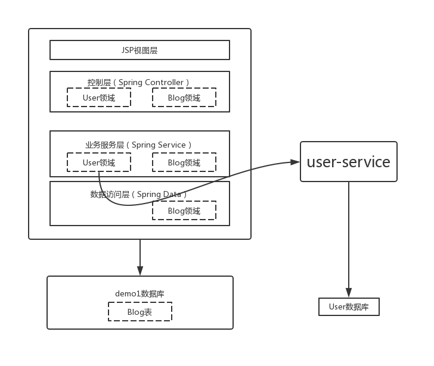

# 系统架构

`demo1-gradually`是一个单体微服务拆分过渡中的应用，包括`demo1`及`user-service`两个部分。其中`demo1`基于Spring Boot构建，整体采用成熟的MVC分层架构，传统绝大多数Java应用都是这种架构。`user-service`为从`demo1`中拆出的一个微服务模块。

最后的系统架构图如下：



# 拆分步骤

1. 将原来`demo1`的数据库建表脚本中与`user-service`相关部分移除，请参考`demo1/demo1gradually_demo1_db.sql`。

2. 将原来`demo1`中`user-service`相关的数据访问层代码移除，请参考`demo1/repository/UserRepository.java`。

3. 修改`demo1`中的`UserService`实现代码，将原来直接访问数据的代码修改为调用`user-service`服务的Restful接口，请参考`demo1/service/impl/UserServiceImpl.java`。


# 部署指引

1. 新建数据库

在mysql数据库中新建数据库`demo1gradually_demo1_db`，参考命令如下：

```sql
create database demo1gradually_demo1_db default character set utf8;
```

初始化数据库表结构，参考命令如下：

```sql
use demo1gradually_demo1_db;
source demo1/demo1gradually_demo1_db.sql
```

在mysql数据库中新建数据库`demo1gradually_user_db`, 参考命令如下：

```sql
create database demo1gradually_user_db default character set utf8;
```

初始化数据库表结构，参考命令如下：

```sql
use demo1gradually_user_db;
source user-service/demo1gradually_user_db.sql
```

2. 修改应用配置文件

修改`demo1`的应用配置文件`demo1/src/main/resources/application.properties`，特别注意数据库连接相应字段的设置

修改`user-service`微服务模块的应用配置文件`user-service/src/main/resources/application.properties`，特别注意数据库连接相应字段的设置

另外为了不绑定IP地址，在应用里均使用`mysql-service`指代mysql的IP地址，请修改部署机上的/etc/hosts，将这两个名称指向正确的IP地址，如下：

```
127.0.0.1 mysql-service
```

3. maven打包应用

安装JDK8及maven后，在本机使用mvn命令对应用进行打包，参考命令如下：

```bash
mvn -DskipTests=true package
```

上述命令会将生成1个war包及一个jar包

4. 提前在虚拟机上设置服务名至ip地址的映射，修改`/etc/hosts`文件:

   ```
   127.0.0.1 user-service
   ```

5. 部署应用到tomcat

上面的命令会生成应用的war包`demo1/target/demo1-0.0.1-SNAPSHOT.war`，将war包部署到Tomcat9上即可，具体可参考[Tomcat的官方文档](http://tomcat.apache.org/tomcat-9.0-doc/deployer-howto.html)。

6. 启动user-service微服务模块

参考命令如下：

```bash
java -jar user-service/target/user-service-0.0.1-SNAPSHOT.jar > user-service.log 2>&1 &
```

第5步及第6步都完成后，即可用浏览器访问`http://${tomcat-server-ip}:8080`即可。

