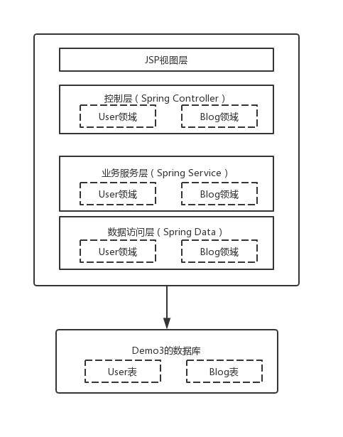

# 系统架构

`demo1`是一个传统的单体应用，其基于Spring Boot构建，整体采用成熟的MVC分层架构，传统绝大多数Java应用都是这种架构。采用JSP作为视图层，采用SpringMVC架构实现控制层，业务数据保存在外部mysql数据库中，所有各层模块等均被揉合在一个项目中，如下图所示。



# 部署指引

1. 新建数据库

在mysql数据库中新建数据库`demo1`，参考命令如下：

```sql
create database demo1 default character set utf8;
```

初始化数据库表结构，参考命令如下：

```sql
use demo1;
source demo1.sql
```

2. 修改应用配置文件

相应地修改应用的配置文件`src/main/resources/application.properties`，特别注意数据库连接相应字段的设置

3. maven打包应用

安装JDK8及maven后，在本机使用mvn命令对应用进行打包，参考命令如下：

```bash
mvn -DskipTests=true package
```

4. 部署应用到tomcat

上面的命令会生成应用的war包`target/demo1-0.0.1-SNAPSHOT.war`，将war包部署到Tomcat9上即可，具体可参考[Tomcat的官方文档](http://tomcat.apache.org/tomcat-9.0-doc/deployer-howto.html)。

部署到Tomcat之后，用浏览器访问`http://${tomcat-server-ip}:8080`即可。

