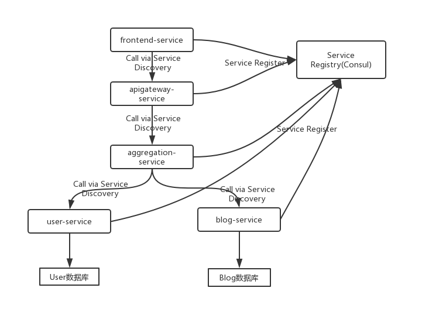

# 系统架构

`demo2`是一个进行了微服务改造后的应用，其基于Spring Cloud构建。其被拆分为`user-service`、`blog-service`、`aggregation-service`、`apigateway-service`、`frontend-service`5个微服务子项目，各微服务的功能概要如下：

1. `user-service`、`blog-service`分别实现对各自业务模型的restful接口； 
2. `aggregation-service`调用`user-service`、`blog-service`，实现了跨业务模型的restful接口；
3. `apigateway-service`通过配置，将`user-service`、`blog-service`、`aggregation-service`的restful接口以统一的形式对暴露API接口; 
4. `frontend-service`采用[Vue.js](https://cn.vuejs.org/index.html)重写了前端，其调用`apigateway-service`暴露的API接口，实现业务逻辑

各微服务自动注册到服务注册中心(Consul)，各微服务相互调用时通过服务发现找到对方。

其架构图如下：



# 部署指引

1. 新建数据库

在mysql数据库中新建`user-service`、`blog-service`依赖的数据库`demo2_user_db`、`demo2_blog_db`，参考命令如下：

```sql
create database demo2_user_db default character set utf8;
create database demo2_blog_db default character set utf8;
```

初始化数据库表结构，参考命令如下：

```sql
use demo2_user_db;
source user-service/demo2_user_db.sql;
use demo2_blog_db;
source blog-service/demo2_blog_db.sql;
```

2. 修改应用配置文件

相应地修改应用的配置文件`user-service/src/main/resources/application.properties`、`blog-service/src/main/resources/application.properties`，特别注意数据库连接相应字段的设置。

另外为了不绑定IP地址，在应用里均使用`consul-service`、`mysql-service`指代consul、mysql的IP地址，请修改部署机上的/etc/hosts，将这两个名称指向正确的IP地址，如下：

```
127.0.0.1 consul-service
127.0.0.1 mysql-service
```

3. maven打包应用

安装JDK8及maven后，在本机使用mvn命令对应用进行打包，参考命令如下：

```bash
mvn -DskipTests=true package
```

上述命令会将生成5个微服务模块的jar包

4. 运行服务注册中心consul

本示例使用consul作为服务的注册中心，在运行应用前须先启动consul，参考命令如下：

```bash
curl -O https://releases.hashicorp.com/consul/1.4.4/consul_1.4.4_linux_amd64.zip
unzip consul_1.4.4_linux_amd64.zip
./consul agent -dev -server -ui -client=0.0.0.0
```

5. 启动应用

依次启动各个微服务模块即可，参考命令如下：

```bash
java -jar user-service/target/user-service-0.0.1-SNAPSHOT.jar > user-service.log 2>&1 &
java -jar blog-service/target/blog-service-0.0.1-SNAPSHOT.jar > blog-service.log 2>&1 &
java -jar aggregation-service/target/aggregation-service-0.0.1-SNAPSHOT.jar > aggregation-service.log 2>&1 &
java -jar apigateway-service/target/apigateway-service-0.0.1-SNAPSHOT.jar > apigateway-service.log 2>&1 &
java -jar frontend-service/target/frontend-service-0.0.1-SNAPSHOT.jar > frontend-service.log 2>&1 &
```

各微服务模块均启动后，用浏览器访问`http://${frontend-service-ip}:8085`即可。
