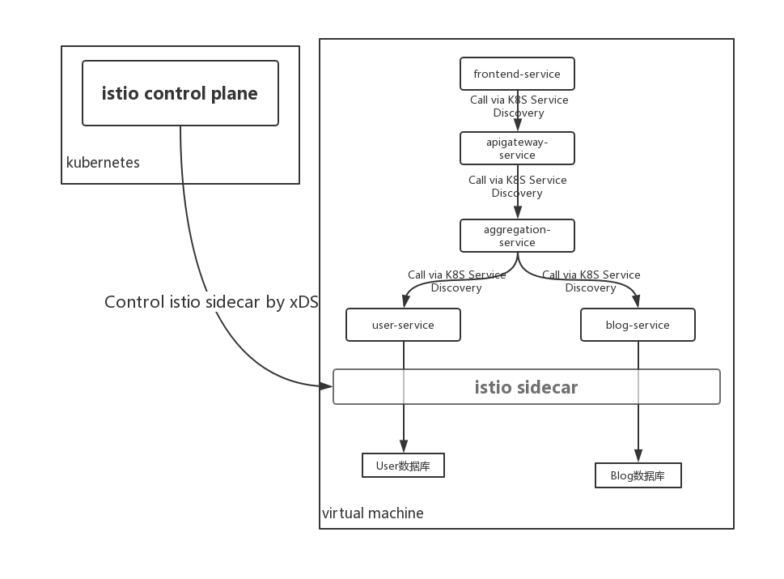

# 系统架构

`demo3`在`demo2`基础上进行了简单的调整，以适应将其部署到虚拟机，并由Istio服务网格纲管的场景。最终达成的系统架构如下：



注意事项：

1. 因为在服务被istio纳管的过程中，会将各个微服务包装成kubernetes里的服务。因此服务间的调用可以直接用kubernetes的服务发现机制了，因此不再依赖Consul服务注册中心了。
2. 在虚拟机中的各个微服务的HTTP请求输入输出都会被`istio-sidecar`拦截，而`istio control plane`可通过`xDS`控制`istio sidecar`的拦截代理功能。

# 调整事项

要让原来的Spring Cloud应用能被istio纳管，需要将Spring Cloud应用中原有的一些微服务能力禁用掉，这个涉及一系列的改造调整项，这里简述如下：

1. 禁用服务注册

由istio纳管后，服务实例的注册将在部署阶段完成，因此不再需要依赖consul服务注册中心，也不需要向consul注册服务，进行以下两步操作就可以了。

* `application.properties`里的`spring.cloud.consul.discovery.register`设置为`fase`即可

  `application.properties`

  ```properties
  spring.cloud.consul.discovery.register=false
  ```

* 各微服务模块去除对`spring-cloud-starter-consul-discovery`的maven依赖

  `pom.xml`

  ```xml
  <!--<dependency>-->
  	<!--<groupId>org.springframework.cloud</groupId>-->
  	<!--<artifactId>spring-cloud-starter-consul-discovery</artifactId>-->
  <!--</dependency>-->
  ```


2. 由istio纲管后，服务之前的调用将由envoy拦截请求，并自动发现要调用的服务实例，因此调用其它服务时，须禁用原来的服务机制，而改为以`服务名称+端口`方式调用。

   * 对FeignClient方式的服务间调用，可添加url参数直接指定其它服务的名称，如下：

       `aggregation-service/src/main/java/personal/jeremyxu/archrevolutition/demo3/aggregationservice/service/UserFeignService.java`

       ```java
       // 以`服务名称+端口`方式调用
       //@FeignClient(value = "user-service")
       @FeignClient(value = "user-service", url = "http://user-service:8081")
       @RequestMapping(value = "/api/v1")
       public interface UserFeignService {
           @DeleteMapping("/users/{id}")
           Integer deleteUser(@PathVariable("id") Integer userId);
       
           @GetMapping("/users/{id}")
           UserDTO getUser(@PathVariable("id") Integer userId);
       }
       
       ```

   * 对于`RestTemplate`方式的服务间调用，须禁用RestTemplate的负载均衡特性，并修改为以`服务名称+端口`方式调用，如下：

       `aggregation-service/src/main/java/personal/jeremyxu/archrevolutition/demo3/aggregationservice/AggregationServiceApplication.java`

       ```java
       @Bean
       //禁用RestTemplate的负载均衡特性
       //@LoadBalanced
       RestTemplate restTemplate() {
           return new RestTemplate();
       }
       ```

       `aggregationservice/service/impl/BlogProxyServiceImpl.java`

       ```java
       @Service
       public class BlogProxyServiceImpl implements BlogProxyService {
       
           @Autowired
           RestTemplate restTemplate;
       
           @Override
           public void deleteBlogsByUserId(Integer userId) {
               Map<String, Object> uriVariables = new HashMap();
               uriVariables.put("userId", userId);
               // 以"服务名称+端口"方式调用
       //        restTemplate.delete("http://blog-service/api/v1/blogs/by_userId/{userId}", uriVariables);
               restTemplate.delete("http://blog-service:8082/api/v1/blogs/by_userId/{userId}", uriVariables);
           }
       
           @Override
           public List<Blog> getBlogs() {
               // 以"服务名称+端口"方式调用
       //        Blog[] blogs = restTemplate.getForObject("http://blog-service/api/v1/blogs", Blog[].class);
               Blog[] blogs = restTemplate.getForObject("http://blog-service:8082/api/v1/blogs", Blog[].class);
               return Arrays.asList(blogs);
           }
       
           @Override
           public Blog getBlog(Integer blogId) {
               Map<String, Object> uriVariables = new HashMap();
               uriVariables.put("blogId", blogId);
               // 以"服务名称+端口"方式调用
       //        return restTemplate.getForObject("http://blog-service/api/v1/blogs/{blogId}", Blog.class, uriVariables);
               return restTemplate.getForObject("http://blog-service:8082/api/v1/blogs/{blogId}", Blog.class, uriVariables);
           }
       }
       ```

       

   * 对于`Spring Cloud Gateway`调用其它服务的场景，须禁用负载均衡模式，修改为`服务名称+端口`普通HTTP调用模式，如下：

       `apigateway-service/src/main/resources/application.yaml`

       ```yaml
           gateway:
             routes:
               - id: user_service_route
                 # 使用http及服务名称方式调用其它服务
       #          uri: lb://user-service
                 uri: http://user-service:8081
                 predicates:
                   - Path=/api/users,/api/users/**
                 filters:
                   - RewritePath=/api/users(?<segment>.*), /api/v1/users$\{segment}
               - id: blog_service_route
                 # 使用http及服务名称方式调用其它服务
       #          uri: lb://blog-service
                 uri: http://blog-service:8082
                 predicates:
                   - Path=/api/blogs,/api/blogs/**
                 filters:
                   - RewritePath=/api/blogs(?<segment>.*), /api/v1/blogs$\{segment}
               - id: aggregation_service_route
                 # 使用http及服务名称方式调用其它服务
       #          uri: lb://aggregation-service
                 uri: http://aggregation-service:8083
                 predicates:
                   - Path=/api/aggregation/**
                 filters:
                   - RewritePath=/api/aggregation(?<segment>.*), /api/v1/aggregation$\{segment}
       ```

       

3. 由于istio纲管后，服务寻址已由istio接管，因此Spring Cloud代码里不应该再使用`DiscoveryClient`，相关改造如下：

   `frontendservice/FrontendServiceApplication.java`

   ```java
   @SpringBootApplication
   //禁用DiscoveryClient
   //@EnableDiscoveryClient
   public class FrontendServiceApplication {
   
       public static void main(String[] args) {
           SpringApplication.run(FrontendServiceApplication.class, args);
       }
   
   }
   ```

   `frontendservice/controller/FrontendController.java`

   ```java
   @Controller
   public class FrontendController {
   
   // 禁用DiscoveryClient
   //    @Autowired
   //    DiscoveryClient discoveryClient;
   
       @Value("${app.apiGatewayUrl}")
       String apiGatewayURL;
   
       @RequestMapping(value = "/api/injectClientConfig", method = RequestMethod.GET, produces = "text/javascript; charset=utf-8")
       public @ResponseBody String injectClientInfo(HttpServletRequest request, HttpSession session){
   //        List<ServiceInstance> instances = discoveryClient.getInstances("apigateway-service");
   //        if (instances.size() > 0){
   //            ServiceInstance instance = instances.get(0);
   //            String apiGatewayURL = String.format("http://%s:%d", instance.getHost(), instance.getPort());
   //            return String.format("window.API_GATEWAY_URL='%s';", apiGatewayURL);
   //        }
   //        return "if(window.console){window.console.log('not discovery api gateway address, use default.');}";
   
           // 直接输出API Gateway的访问地址
           return String.format("window.API_GATEWAY_URL='%s';", apiGatewayURL);
       }
   }
   ```

   `frontend-service/src/main/resources/application.properties`

   ```properties
   #在具体的部署场景，应用的API网关地址是确定的
   app.apiGatewayUrl=http://192.168.2.200:8084
   ```

4. 禁用ribbon的各种超时设置

   应用间调用由istio接管后，服务调用的超时不应该在Spring Cloud应用中继续设置了，因此需要禁用相关设置，这个一般在应用的配置文件中进行配置即可，如下：

   ```properties
   #ribbon不使用eureka服务发现
   ribbon.eureka.enabled=false
   #注释掉ribbon的超时设置
   #ribbon.ConnectTimeout=60000
   #ribbon.ReadTimeout=60000
   #注释掉ribbon的超时设置
   #ribbon.readTimeout=60000
   #ribbon.connectTimeout=60000
   ```

4. 禁用feign调用的熔断特性

   应用间调用由istio接管后，服务间调用熔断由istio进行配置管理，不应该在Spring Cloud应用中继续设置了，因此需要禁用该功能，这个一般在应用的配置文件中进行配置即可，如下：

   ```properties
   feign.hystrix.enabled=false
   ```

5. 应用传递调用链信息

   为保证最终呈现的服务调用链信息完整，istio要求应用必须在调用过程中负责传递相关的请求头，见[这里](https://archive.istio.io/v1.0/docs/tasks/telemetry/distributed-tracing/#understanding-what-happened)。为了简化改造所需的操作，这里提供一个快速方案，在调用其它服务的模块中直接添加一个maven依赖即可。

   ```xml
   <dependency>
       <groupId>personal.jeremyxu.archrevolutition.demo3</groupId>
       <artifactId>springcloud-tracing-support</artifactId>
       <version>0.0.1-SNAPSHOT</version>
   </dependency>
   ```

   **`apigateway-service`调用其它服务时本身会完整传递请求头，这个不用特殊处理**

# 部署指引

经过上面的修改后，整个应用就被改造成一个比较纯粹的微服务应用了，类似于istio的官方示例[bookinfo](https://archive.istio.io/v1.0/docs/examples/bookinfo/)。

接下来将这个微服务应用部署在某个虚拟机上，步骤照旧：

1. 新建数据库

在mysql数据库中新建`user-service`、`blog-service`依赖的数据库`demo3_user_db`、`demo3_blog_db`，参考命令如下：

```sql
create database demo3_user_db default character set utf8;
create database demo3_blog_db default character set utf8;
```

初始化数据库表结构，参考命令如下：

```sql
use demo3_user_db;
source user-service/demo3_user_db.sql;
use demo3_blog_db;
source blog-service/demo3_blog_db.sql;
```

2. 修改应用配置文件

相应地修改应用的配置文件`user-service/src/main/resources/application.properties`、`blog-service/src/main/resources/application.properties`，特别注意数据库连接相应字段的设置。

另外为了不绑定IP地址，在应用里均使用~~`consul-service`、~~`mysql-service`指代~~consul、~~mysql的IP地址，请修改部署机上的/etc/hosts，将这两个名称指向正确的IP地址，如下：

```
127.0.0.1 consul-service
127.0.0.1 mysql-service
```

3. maven打包应用

安装JDK8及maven后，在本机使用mvn命令对应用进行打包，参考命令如下：

```bash
mvn -DskipTests=true package
```

上述命令会将生成5个微服务模块的jar包

4. ~~运行服务注册中心consul(运行时已不再依赖于consul)~~

~~本示例使用consul作为服务的注册中心，在运行应用前须先启动consul，参考命令如下：~~

```bash
curl -O https://releases.hashicorp.com/consul/1.4.4/consul_1.4.4_linux_amd64.zip
unzip consul_1.4.4_linux_amd64.zip
./consul agent -dev -server -ui -client=0.0.0.0
```

5. 提前在虚拟机上设置服务名至ip地址的映射，修改`/etc/hosts`文件:

   ```
   127.0.0.1 user-service
   127.0.0.1 blog-service
   127.0.0.1 aggregation-service
   127.0.0.1 apigateway-service
   127.0.0.1 frontend-service
   ```

6. 启动应用

依次启动各个微服务模块即可，参考命令如下：

```bash
java -jar user-service/target/user-service-0.0.1-SNAPSHOT.jar > user-service.log 2>&1 &
java -jar blog-service/target/blog-service-0.0.1-SNAPSHOT.jar > blog-service.log 2>&1 &
java -jar aggregation-service/target/aggregation-service-0.0.1-SNAPSHOT.jar > aggregation-service.log 2>&1 &
java -jar apigateway-service/target/apigateway-service-0.0.1-SNAPSHOT.jar > apigateway-service.log 2>&1 &
java -jar frontend-service/target/frontend-service-0.0.1-SNAPSHOT.jar > frontend-service.log 2>&1 &
```

各微服务模块均启动后，用浏览器访问`http://${frontend-service-ip}:8085`，验证服务功能是否一切正常。
7. 在kubernetes里安装istio的控制平面

   可使用hem chart部署，比较简单，参考命令如下：

   ```bash
   kubectl create ns istio-system
   helm install --name istio --namespace istio-system ./istio-1.0.6.tgz -f istio_custom.yaml
   ```

8. 在虚拟机上安装istio-sidecar

目前在虚拟机上安装istio-sidecar比较复杂，可参考[这里](https://git.code.oa.com/tshift/tshit/blob/master/components/thirdparty-integration/istio_mesh_expansion/istio_mesh_expansion.md)，这里列几个关键点：

* 虚拟机要能打通到istio控制面service，pod的网络，能ping通kubernetes里pod的IP，能通过clusterIP telnet通kubernetes里的服务，这个可以在虚拟机上添加两条路由规则实现。
* 虚拟机上能解析kubernetes里长服务域名(istio-pilot.istio-system.svc.cluster.local)及短服务域名(istio-pilot.istio-system)，这个可以通过在虚拟机上安装dnsmasq，将DNS指向它，并进行相关设置解决。
* 由于istio官方没有提供centos7下的istio-sidecar软件包，因此需要[参考文档-1.5 安装istio_sidecar](https://git.code.oa.com/tshift/tshit/blob/master/components/thirdparty-integration/istio_mesh_expansion/istio_mesh_expansion.md)手动安装istio-sidecar，**后续考虑封装istio-sidecar的rpm包以简化该步操作**。
* 虚拟机要保持与istio控制平面的时间同步

9. 创建应用对应的命名空间

   被istio纳管的微服务必须在某个kubernetes命名空间里，因此这里创建demo3应用对应的命名空间，参考命令如下：

   ```bash
   kubectl create ns demo3
   kubectl label namespace demo3 istio-injection=enabled
   ```

10. 导出应用命名空间的mTLS证书

    istio会在打上`istio-injection`标签的命名空间下生成mTLS证书，当启用mTLS时，会用到这些证书，导致证书命令如下：

    ```bash
    kubectl -n demo3 get secret istio.default -o yaml -o jsonpath='{.data.root-cert\.pem}' | base64 -d > root-cert.pem
    kubectl -n demo3 get secret istio.default -o yaml -o jsonpath='{.data.cert-chain\.pem}' | base64 -d > cert-chain.pem
    kubectl -n demo3 get secret istio.default -o yaml -o jsonpath='{.data.key\.pem}' | base64 -d > key.pem
    ```

    将得到的3个文件`key.pem`, `root-cert.pem`, `cert-chain.pem`复制到每台服务器的 `/etc/certs`目录中，并保证istio-proxy用户可读。

11. 配置istio-sidecar，使istio-sidecar拦截demo3的相关进程

    需要修改`/etc/istio/envoy/cluster.env`文件，以使istio-sidecar拦截demo3的相关进程：

    `/etc/istio/envoy/cluster.env`

    ```
    ...
    # 多个端口用逗号隔开，如8081,8082，因为envoy拦截虚拟机上的mysql会导致mysql不可连，这里不拦截mysql服务
    ISTIO_INBOUND_PORTS=8081,8082,8083,8084,8085
    ISTIO_NAMESPACE=demo3
    ISTIO_SVC_IP=192.168.2.200
    ```

    其中`ISTIO_SVC_IP`为虚拟机的ip地址。

12. 将虚拟机上各微服务注册为ServiceEntry

    istio中通过将一些外部服务注册为ServiceEntry，以便将这些服务纳入Pilot的抽象模型，在服务网格中的其它服务即可发现它们，参考命令如下：

    ```bash
    kubectl -n demo3 apply -f manifests/demo3-service-entry.yaml
    ```

13. 将虚拟机上的各微服务注册为kubernetes里的`selector-less`服务

    为了使DNS能正确解析服务的全域名，须将虚拟机上的各微服务注册为kubernetes里的`selector-less`服务，参考命令如下：

    ```bash
    kubectl -n demo3 apply -f manifests/demo3-selector-less-svc.yaml
    ```

14. 导入istio流量路由规则

    导入istio的流量路由规则，参考命令如下：

    ```bash
    kubectl -n demo3 apply -f manifests/demo3-istio-route-rules.yaml    
    ```

15. 停止正在运行的微服务应用，参考命令如下：

    ```bash
    ps -ef|grep 'frontend\-service'|grep -v grep|awk '{print $2}'|xargs kill -15
    ps -ef|grep 'apigateway\-service'|grep -v grep|awk '{print $2}'|xargs kill -15
    ps -ef|grep 'aggregation\-service'|grep -v grep|awk '{print $2}'|xargs kill -15
    ps -ef|grep 'blog\-service'|grep -v grep|awk '{print $2}'|xargs kill -15
    ps -ef|grep 'user\-service'|grep -v grep|awk '{print $2}'|xargs kill -15
    ```

16. 取消服务名到ip地址的映射

    当服务间调用的流量被istio劫持后，不再需要在`/etc/hosts`中指向各服务名到ip地址的映射，因此取消。

    `/etc/hosts`

    ```
    #127.0.0.1 consul-service
    #127.0.0.1 mysql-service
    #127.0.0.1 user-service
    #127.0.0.1 blog-service
    #127.0.0.1 aggregation-service
    #127.0.0.1 apigateway-service
    #127.0.0.1 frontend-service
    ```

17. 在kubedns中指定上述服务的Service IP，

    因为在应用中使用了服务的短名，为了让这些服务名称被正确解析，新增以下名字解析定义，参考命令如下：

    ```bash
    USER_SVC_IP=$(kubectl -n demo3 get svc user-service -o=jsonpath={.spec.clusterIP})
    BLOG_SVC_IP=$(kubectl -n demo3 get svc blog-service -o=jsonpath={.spec.clusterIP})
    AGGREGATION_SVC_IP=$(kubectl -n demo3 get svc aggregation-service -o=jsonpath={.spec.clusterIP})
    APIGATEWAY_SVC_IP=$(kubectl -n demo3 get svc apigateway-service -o=jsonpath={.spec.clusterIP})
    FRONTEND_SVC_IP=$(kubectl -n demo3 get svc frontend-service -o=jsonpath={.spec.clusterIP})
    # envoy拦截虚拟机上的mysql会导致mysql不可连，直接指定mysql服务的IP地址
    MYSQL_SVC_IP=127.0.0.1
    
    cat << EOF >> /etc/dnsmasq.d/kubedns
    address=/user-service/${USER_SVC_IP}
    address=/blog-service/${BLOG_SVC_IP}
    address=/aggregation-service/${AGGREGATION_SVC_IP}
    address=/apigateway-service/${APIGATEWAY_SVC_IP}
    address=/frontend-service/${FRONTEND_SVC_IP}
    address=/mysql-service/${MYSQL_SVC_IP}
    EOF
    
    # 重启dnsmasq服务
    systemctl restart dnsmasq.service 
    ```

18. 启动istio相关的服务，参考命令如下：

    ```bash
    sudo systemctl start istio-auth-node-agent
    sudo systemctl start istio    
    ```

19. 将API网关地址修改为正确的域名

    `frontend-service/src/main/resources/application.properties`

    ```properties
    app.apiGatewayUrl=http://demo3.arch-revolution.tcnp-dev.oa.com
    ```

20. 以非root用户重新启动各微服务模块

    由于istio-sidecar不拦截root用户的流量，因此需要新建用户，并以该用户运行各微服务模块，参考命令如下：

    ```bash
    sudo groupadd demo3
    sudo useradd -g demo3 demo3
    
    # 切换为demo3用户，以demo3用户运行各微服务模块
    su - demo3
    java -jar user-service/target/user-service-0.0.1-SNAPSHOT.jar > user-service.log 2>&1 &
    java -jar blog-service/target/blog-service-0.0.1-SNAPSHOT.jar > blog-service.log 2>&1 &
    java -jar aggregation-service/target/aggregation-service-0.0.1-SNAPSHOT.jar > aggregation-service.log 2>&1 &
    java -jar apigateway-service/target/apigateway-service-0.0.1-SNAPSHOT.jar > apigateway-service.log 2>&1 &
    java -jar frontend-service/target/frontend-service-0.0.1-SNAPSHOT.jar > frontend-service.log 2>&1 &
    ```

至此，整个demo3应用即部署到虚拟机，并由istio纳管了。可用浏览器访问`http://demo3.arch-revolution.tcnp-dev.oa.com`以观察各个demo3应用是否正常。

