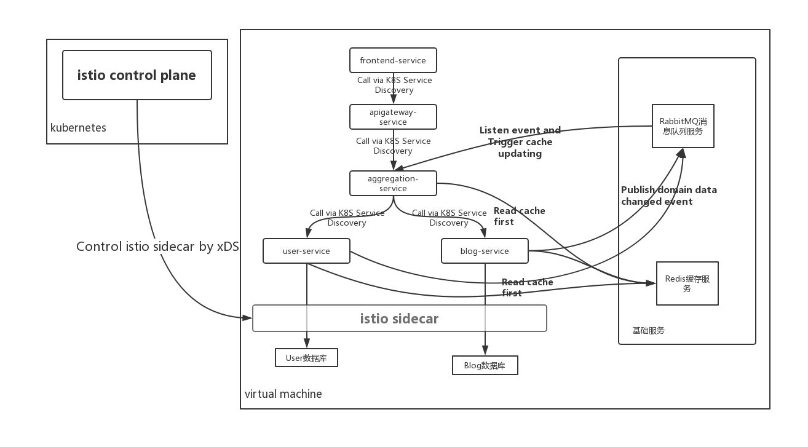
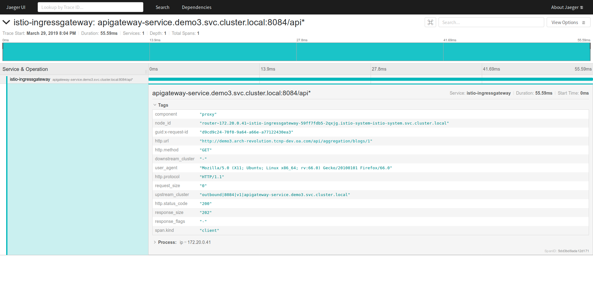

# 系统架构

`demo4`在`demo3`的基础之上，为优化应用性能，加入了缓存服务、消息队列服务，最终达成的架构如下：



# 性能问题

demo3已经是一个比较良好的微服务架构应用，并且由istio纳管后，我们可以在istio自带的调用链跟踪系统里看到每个接口实际情况，真正做到了对微服务的可观察性。



但从上图，我们也看到一些问题，仅仅请求一个博文详情，竟然要50+ms，显然性能并不好。由于应用已经被拆成了多个微服务，我们只要保证各服务间的接口不发生变化，就可以很轻松地从架构上对应用进行改进（这个正体现了微服务架构的优势）。

# 架构优化

1. 引入缓存中间件

   经过分析，我们发现接口响应较慢的原因是进行数据库查询，因而很自然地想到使用缓存。这里我们使用redis-server作为缓存中间件。Spring Cloud应用里使用Redis缓存也比较简单，改造步骤简述如下：

   * 微服务模块添加maven依赖

     `user-service/pom.xml`

     ```xml
     <dependency>
         <groupId>org.springframework.boot</groupId>
         <artifactId>spring-boot-starter-redis</artifactId>
     </dependency>
     ```

   * 应用配置文件里添加redis连接信息

     `user-service/src/main/resources/application.properties`

     ```properties
     # REDIS (RedisProperties)
     # Redis数据库索引（默认为0）
     spring.redis.database=0
     # Redis服务器地址
     spring.redis.host=redis-service
     # Redis服务器连接端口
     spring.redis.port=6379
     # Redis服务器连接密码（默认为空）
     spring.redis.password=
     # 连接池最大连接数（使用负值表示没有限制）
     spring.redis.jedis.pool.max-active=8
     # 连接池最大阻塞等待时间（使用负值表示没有限制）
     spring.redis.jedis.pool.max-wait=-1
     # 连接池中的最大空闲连接
     spring.redis.jedis.pool.max-idle=8
     # 连接池中的最小空闲连接
     spring.redis.jedis.pool.min-idle=0
     # 连接超时时间（毫秒）
     spring.redis.timeout=0
     ```

   * 修改代码，使用缓存

     `userservice/service/impl/UserServiceImpl.java`

     ```java
     @Service
     public class UserServiceImpl implements UserService {
         @Autowired
         UserRepository userRepository;
     
         @Autowired
         RedisTemplate<String, User> redisTemplate;
     
         @Autowired
         private AmqpTemplate rabbitTemplate;
     
         private static final String CACHE_KEY_PREFIX="user_";
     
         @Override
         public List<User> findAll() {
             // 首先从缓存里取数据，缓存为空才查询数据库，查询完数据库后，回填缓存
             Set<String> keys = redisTemplate.keys(CACHE_KEY_PREFIX + "*");
             if (keys.size() == 0) {
                 List<User> users = userRepository.findAll();
                 Map<String, User> map = new HashMap<>();
                 for(User user : users){
                   map.put(CACHE_KEY_PREFIX + user.getId(), user);
                 }
                 redisTemplate.opsForValue().multiSet(map);
                 keys = redisTemplate.keys(CACHE_KEY_PREFIX + "*");
             }
             return redisTemplate.opsForValue().multiGet(keys);
         }
     
         @Override
         public void saveUser(User user) {
             // 保存时更新缓存
             userRepository.saveAndFlush(user);
             redisTemplate.opsForValue().set(CACHE_KEY_PREFIX + user.getId(), user);
     
             // 通过消息队列发送数据变更事件
             this.rabbitTemplate.convertAndSend(USER_EVNETS_QUEUE_NAME, "UserCreatedOrUpdated");
         }
     
         @Override
         public User findUserById(Integer userId) {
             // 首先从缓存里取数据，缓存里没有相应数据才查询数据库，查询完数据库后，回填缓存
             User user = redisTemplate.opsForValue().get(CACHE_KEY_PREFIX + userId);
             if (user == null) {
                 user = userRepository.findById(userId).get();
                 if (user != null) {
                     redisTemplate.opsForValue().set(CACHE_KEY_PREFIX + userId, user);
                 }
             }
             return user;
         }
     
         @Override
         public void deleteById(Integer userId) {
             // 删除时才删除相应的缓存
             userRepository.deleteById(userId);
             userRepository.flush();
             redisTemplate.delete(CACHE_KEY_PREFIX + userId);
     
             // 通过消息队列发送数据变更事件
             this.rabbitTemplate.convertAndSend(USER_EVNETS_QUEUE_NAME, "UserDeleted");
         }
     }
     ```

2. 引入消息队列

   使用缓存的过程中，我们发现一个问题。

   `aggregation-service`模块使用的缓存与`user-service`、`blog-service`模块的领域对象有关联关系。

   而我们希望`user-service`、`blog-service`模块的领域对象发生变化时，`aggregation-service`模块能刷新缓存。

   换句话说`user-service`、`blog-service`模块的领域对象发生变化时，应该通知`aggregation-service`模块刷新缓存。当然为了不降低`user-service`、`blog-service`模块的接口性能，这个通知最好是异步的。

   这里涉及服务间的消息通知，我们很自然地使用消息队列技术来处理这个问题，这里我们使用rabbitmq-server作为消息队列。

   Spring Cloud里使用消息队列也很简单，改造步骤简述如下：

   * 微服务模块添加maven依赖

     `user-service/pom.xml`

     ```xml
     <dependency>
         <groupId>org.springframework.boot</groupId>
         <artifactId>spring-boot-starter-amqp</artifactId>
     </dependency>
     ```

   * 应用配置文件里添加redis连接信息

     `user-service/src/main/resources/application.properties`

     ```properties
     spring.rabbitmq.host=rabbitmq-service
     spring.rabbitmq.port=5672
     spring.rabbitmq.username=guest
     spring.rabbitmq.password=guest
     ```

   * 修改代码，使用消息队列收发消息

     消息发送方式改造如下：

     `demo4/user-service/src/main/java/personal/jeremyxu/archrevolutition/demo4/userservice/config/QueueConfig.java`

     ```java
     @Configuration
     public class QueueConfig {
     
         public static final String USER_EVNETS_QUEUE_NAME = "userEvents";
     
         @Bean
         public Queue userEventsQueue() {
             return new Queue(USER_EVNETS_QUEUE_NAME);
         }
     
     }
     ```

     `userservice/service/impl/UserServiceImpl.java`

     ```java
     @Autowired
     private AmqpTemplate rabbitTemplate;
     
     @Override
     public void saveUser(User user) {
         ...
         // 通过消息队列发送数据变更事件
         this.rabbitTemplate.convertAndSend(USER_EVNETS_QUEUE_NAME, "UserCreatedOrUpdated");
     }
     ```

     消息接收方改造如下：

     `aggregation-service/src/main/java/personal/jeremyxu/archrevolutition/demo4/aggregationservice/config/QueueConfig.java`

     ```java
     @Configuration
     public class QueueConfig {
     
         public static final String USER_EVNETS_QUEUE_NAME = "userEvents";
     
         public static final String BLOG_EVNETS_QUEUE_NAME = "blogEvents";
     
         @Bean
         public Queue blogEventsQueue() {
             return new Queue(BLOG_EVNETS_QUEUE_NAME);
         }
     
         @Bean
         public Queue userEventsQueue() {
             return new Queue(USER_EVNETS_QUEUE_NAME);
         }
     
     }
     ```

     `aggregation-service/src/main/java/personal/jeremyxu/archrevolutition/demo4/aggregationservice/service/impl/AggregationServiceImpl.java`

     ```java
     @Service
     // 监听USER_EVNETS_QUEUE_NAME、BLOG_EVNETS_QUEUE_NAME这两个队列里的消息
     @RabbitListener(queues = {USER_EVNETS_QUEUE_NAME, BLOG_EVNETS_QUEUE_NAME})
     public class AggregationServiceImpl implements AggregationService {
         ....
             
         @RabbitHandler
         public void process(String payload) {
             // 从消息队列接收数据变更事件，收到后重新加载数据并更新缓存
             refreshBlogDTOsCache();
         }
         
         private void refreshBlogDTOsCache() {
             // 先取到博文列表
             List<Blog> blogs = blogProxyService.getBlogs();
             // 再补充其它关联字段
             Map<String, BlogDTO> map = new HashMap<String, BlogDTO>();
             for (Blog b : blogs) {
                 BlogDTO blog = convertToBlogDTO(b);
                 map.put(CACHE_KEY_PREFIX + blog.getId(), blog);
             }
             redisTemplate.opsForValue().multiSet(map);
         }
     }
     ```

# 部署指引

部署方法与demo3相比很类似，只是需要提前启动redis-server、rabbitmq-server，这个参考[redis-server](https://redis.io/documentation)、[rabbitmq-server](https://www.rabbitmq.com/download.html)的官方文档，这里就不赘述了。
要注意为了让程序能识别`redis-service`、`rabbitmq-service`这两个服务名，需要提前将这两个服务名的定义添加到`/etc/dnsmasq.d/kubedns`中。
