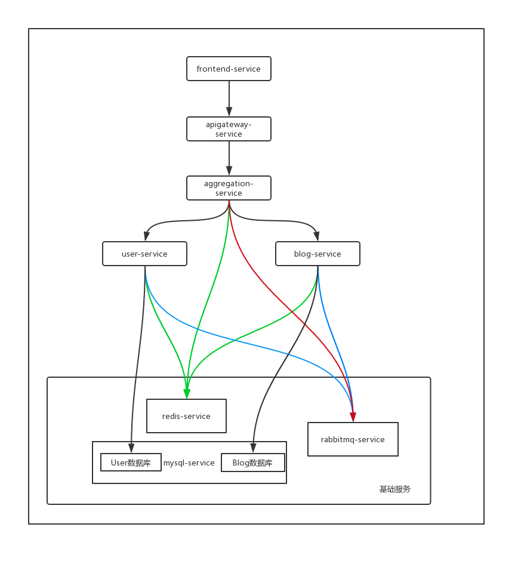

应用经过一系列演进后，最终演进成为了云原生应用。为了方便容器平台的运维人员快速了解应用，从而高效地实施应用的运维操作，建议在完成改造后整理应用的相关说明文档，作为应用交付产物的一部分。

这里我们整理了demo6的应用交付说明文档，大家可以将这个作为应用的交付模板。

## 1. 应用简述

demo6是一个简单的示例微服务应用，其由spring boot及Go语言编写的多个微服务模块构成。

## 2. 应用构成

| 应用微服务模块名称 |   模块服务端口   |   是否无状态   |  需要的CPU（单位vcpu）   |  需要的内存（单位M）   |   需要的存储空间（单位G）   |
| ------------------ | ---- | ---- | ---- | ---- | ---- |
| user-service | http/8081 | 无状态 | 无特殊要求 | 无特殊要求 | 不需要 |
| blog-service | http/8082 | 无状态 | 无特殊要求 | 无特殊要求 | 不需要 |
| aggregation-service | http/8083 | 无状态 | 无特殊要求 | 无特殊要求 | 不需要 |
| apigateway-service | http/8084 | 无状态 | 无特殊要求 | 无特殊要求 | 不需要 |
| frontend-service | http/8085 | 无状态 | 无特殊要求 | 无特殊要求 | 不需要 |
| mysql-service | tcp/3306 | 有状态 | 0.5 | 512 | 10 |
| redis-service | tcp/6379 | 有状态 | 0.5 | 1024 | 2 |
| rabbitmq-service | tcp/5672 | 有状态 | 0.5 | 1024 | 2 |

## 3. 应用各微服务调用关系

## 4. 应用依赖的镜像

| 应用微服务模块名称 |   docker镜像名称  |   docker镜像tag   | 相关dockerfile |
| ------------------ | ---- | ---- | ---- |
| user-service | demo6/user-service | 0.0.1-SNAPSHOT | [user-service的Dockerfile](user-service/docker/Dockerfile) |
| blog-service | demo6/blog-service | 0.0.1-SNAPSHOT | [blog-service的pom.xml](blog-service/pom.xml)(直接由mvn命令生成docker镜像) |
| aggregation-service | demo6/aggregation-service | 0.0.1-SNAPSHOT | [aggregation-service的pom.xml](aggregation-service/pom.xml)(直接由mvn命令生成docker镜像) |
| apigateway-service | demo6/apigateway-service | 0.0.1-SNAPSHOT | [apigateway-service的pom.xml](apigateway-service/pom.xml)(直接由mvn命令生成docker镜像) |
| frontend-service | demo6/frontend-service | 0.0.1-SNAPSHOT | [frontend-service的pom.xml](frontend-service/pom.xml)(直接由mvn命令生成docker镜像) |
| mysql-service | mysql busybox  | 5.7.14 1.29.3 | 官方镜像 |
| redis-service | bitnami/redis | 4.0.14 | 官方镜像 |
| rabbitmq-service | bitnami/rabbitmq | 3.7.14 | 官方镜像 |

## 5. 应用部署的chart包

应用部署到kubernetes里所使用的[chart包](../chart/demo6)

